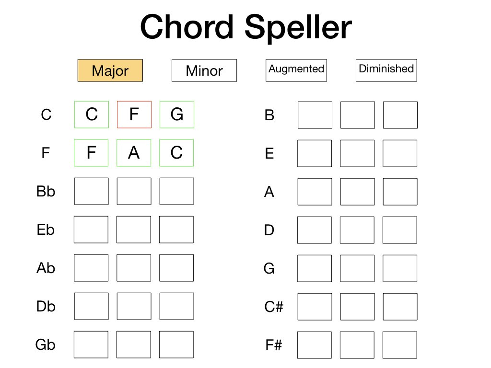

## Chord Speller

#### Introduction

**Title**: Chord Speller

This app tests a user on basic triad and four-note spellings of music chords. The goal of the app is to make sure musicians / students of music have a solid grasp of building basic chords which can help with music improvisation as well as songwriting and composition. After the user has typed in the correct note, the border of the input turns green, and red when incorrect.

##### Start-up Server

To run the server, NPM or Yarn must be installed.

Open up the terminal and go to the project directory.  Inside of the project directory, run:

`npm install`

`npm start`

If you have Yarn installed run:

`yarn start`

This project was built using *Create React App*.  For complete technical details click [Create React App](./docs/README.md)

##### Technical Components
- Flexbox  
- Media queries used to build the *responsive design*.
- JavaScript (ECMASript 6)
- React 16.5.2

##### Articles and Tutorials

#### Picture of React Component Map

#### Pictures of Responsive Design
##### Phone

##### Tablet

##### Desktop

#### Planning and Workflow

#### Future Features
- add a timer for extra challenge
- add staff with treble or bass clef options
- add inversions
- add a section that allows user to build the scales harmonically by drag/drop chord types in order (i.e. drag major for C, drag minor for Dm, drag a minor for Em, a major for F, etc.)
- add a section to randomly test the various note position of a cord (i.e. what's the 5th of Eb major)
- add a comparative section (i.e. ability to compare major sound with minor sound or major sound with augmented sound etc.)
