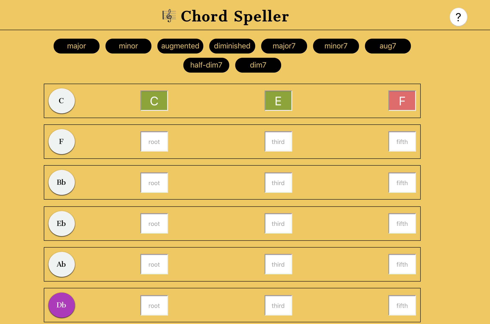
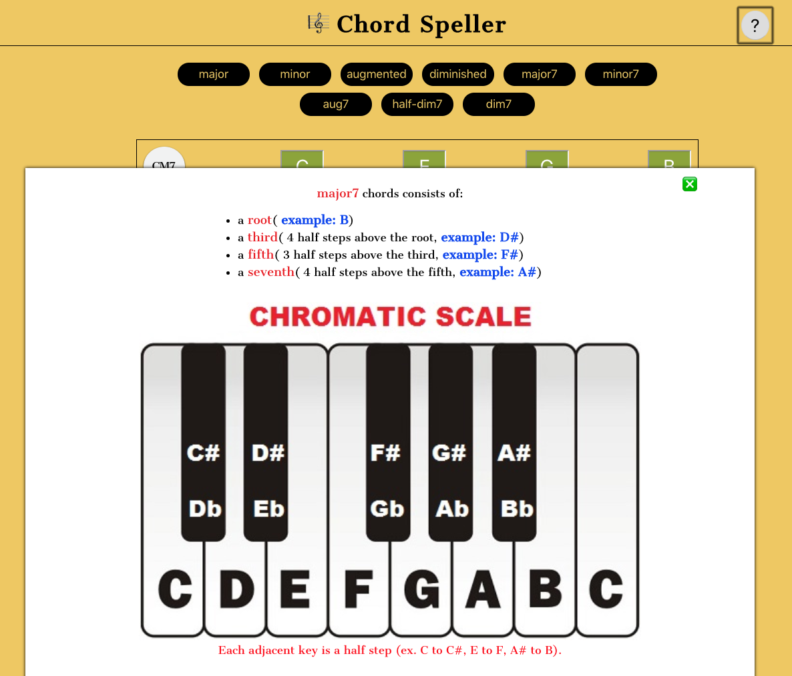
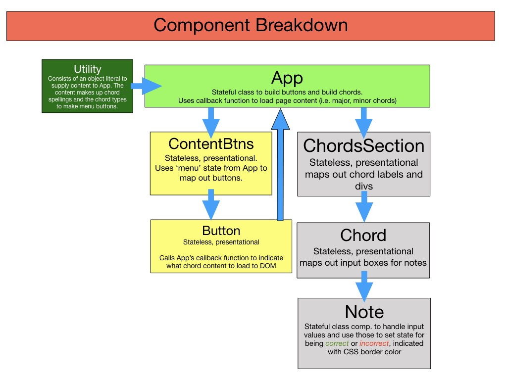
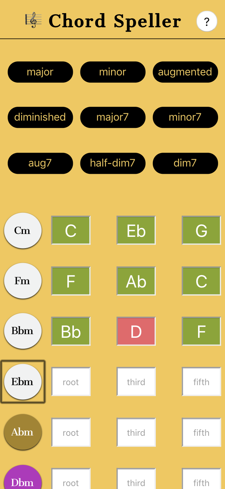
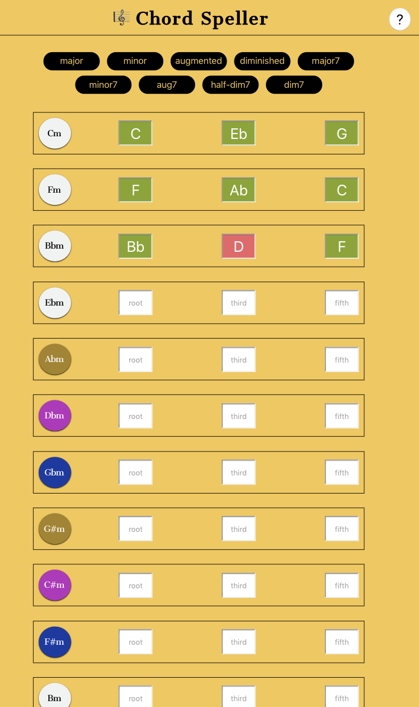
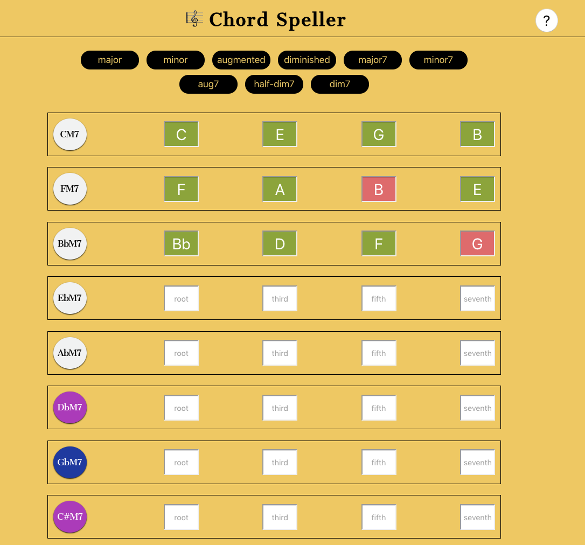

## Chord Speller

### Introduction

<strong>The <em>Chord Speller</em> app tests a user on basic <em>triad</em> and <em>four-note</em> spellings of music chords.</strong> The goal of the app is to enable students of music to have a solid grasp of building basic chords which can help with music improvisation as well as songwriting and composition.

After the user has typed in the correct note, the background of the input turns green and an audio file plays that note, and red when incorrect with no audio file responding.  The user can click the white chord button to hear an audio sample of what the whole chord sounds like.

The <code>?</code> button opens a modal window which explains how to build the type of chord being tested. The example notes are chosen randomly so students see a mixture of samples not just examples in C.

##### Start-up Server

To run the server, NPM or Yarn must be installed.

Open up the terminal and go to the project directory.  Inside of the project directory, run:

`npm install`

`npm start`

If you have Yarn installed run:

`yarn start`

This project was built using *Create React App*.  For complete technical details click [Create React App](./docs/README.md)

##### Technical Components
- Flexbox  
- Media queries used to build the *responsive design*.
- JavaScript (ECMASript 6)
- React 16.5.2

#### Picture of React Component Map

#### Pictures of Responsive Design
###### Phone

###### Tablet

<strong>Note</strong>: Some chord buttons are matched brown, purple, blue indicating these are enharmonic spellings of the same chord.

###### Desktop

#### Future Features
- add a timer for extra challenge
- add staff with treble or bass clef options
- add inversions
- add a section that allows user to build the scales harmonically by drag/drop chord types in order (i.e. drag major for C, drag minor for Dm, drag a minor for Em, a major for F, etc.)
- add a section to randomly test the various note positions of a chord (i.e. what's the 5th of Eb major)
- add a comparative section (i.e. ability to compare major sound with minor sound or major sound with augmented sound etc.)
